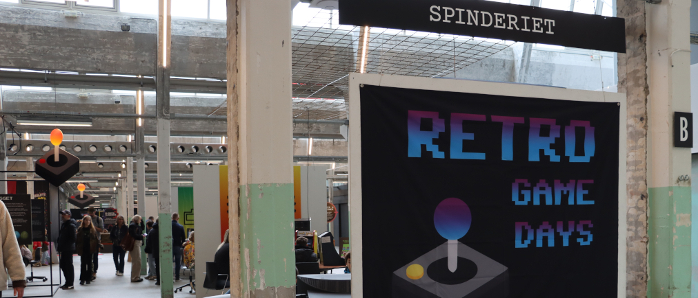

<!-- BEGIN ARISE ------------------------------
Title:: "Find vej:  Spinderihallerne Vejle"

Author:: "Fablab Spinderihallerne, Vejle Museerne og Vejle Bibliotekerne"
Description:: "Her finder du Retro Game Days i Spinderihallerne i Vejle, hvordan du kommer derhen og hvor du kan finde parkeringspladser."
Language:: "da"
Thumbnail:: "kort-150x150.png"
Published Date:: "2025-05-02"
Modified Date:: "2025-07-15"

toc:: "false"
process_markdown:: "true"
content_header:: "false"
---- END ARISE \\ DO NOT MODIFY THIS LINE ---->

# Find vej

Retro Game Days finder sted i Spinderihallerne i Vejle.

>[Spinderihallerne](https://www.spinderihallerne.dk/find-vej/) 
Spinderigade 11 
7100 Vejle 

 

## Parkering
Der er tidsbegrænset parkering omkring Spinderihallerne. Da vi har mange besøgende, kan der være fyldt op, og vi henviser til parkering her:

 - Nyboesgade parkering (ved Vejle Kommune)
 - Parkeringshusene: Albert, Trondur og Cronhammer
 - Parkering Bryggen
 
 Find overblik på Vejle Kommunes "[Kort over parkeringspladserne](https://www.vejle.dk/borger/mit-liv/trafik-og-parkering/parkering/hvor-kan-jeg-parkere/)".
