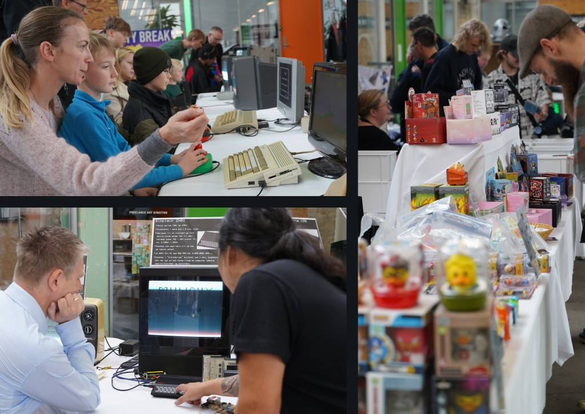
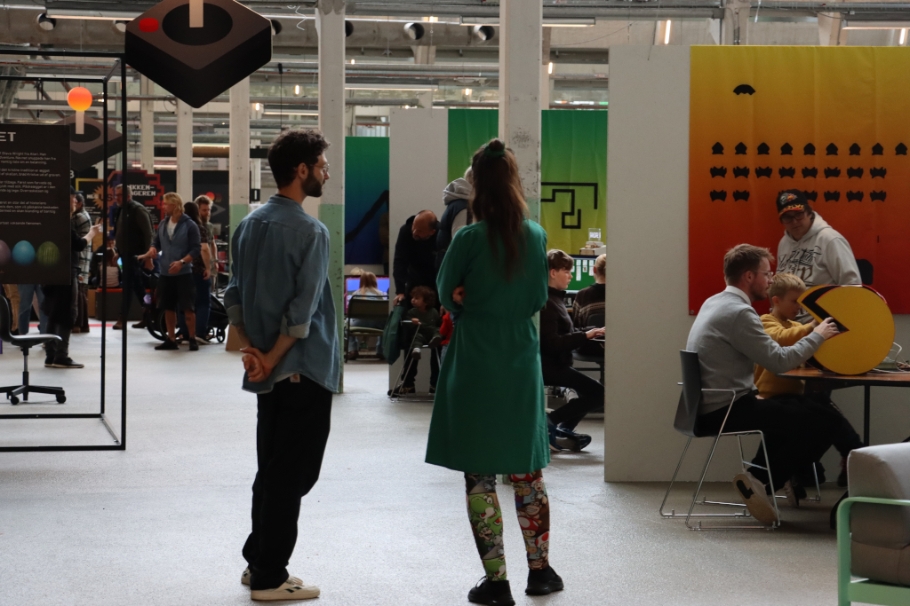

<!-- BEGIN ARISE ------------------------------
Title:: "Spilkultur, historie og fællesskaber"

Author:: "Fablab Spinderihallerne, Vejle Museerne og Vejle Bibliotekerne"
Description:: "Retro Game Days er en fejring af spilkultur, historie og fællesskaber i uge 42: oplev nostalgi og nørderi når du hører lyden af de gamle maskiner"
Language:: "da"
Thumbnail:: "joystick-150x150.png"
Published Date:: "2025-06-17"
Modified Date:: "2025-10-03"

content_header:: "false"
rss_hide:: "true"
---- END ARISE \\ DO NOT MODIFY THIS LINE ---->

# Retro Game Days 2025

>📅  Efterårsferien: Torsdag d. 16. – lørdag d. 18. oktober, kl. 10.00-17.00 
>
>📍  Spinderihallerne, Vejle
>
>🎟️  Lørdag: Voksne 40 kr. / Børn 20 kr. 
>
>🎟️  Torsdag og fredag: GRATIS ADGANG
>
>🌐  Besøg [event på facebook](https://www.facebook.com/events/727221046554171)

Er du klar til årets ultimative retro-fix? Spinderihallerne bliver igen fyldt med blip, bloops og nostalgiske pixel-drømme, når RETRO GAME DAYS 2025 åbner dørene for både hardcore gamere, samlere og nysgerrige nostalgikere.

Vi glæder os til at byde jer velkommen til tre dage spækket med nostalgi, nørderi og uforglemmelige spiloplevelser for hele familien!

Se detaljeret program nedenfor!

## Programoversigt 

### Spil løs!
* Arkademaskiner 
* Flippermaskiner 
* Originale konsoller og emulatorer 
* Retro-PC'er 

### Nørdzonen 

#### Alle dage 
* Nicklas D: Final Fantasy-samling 
* Thomas: Amiga & Commodore 64 
* Margrethe: Podcasten Easter Eggs & Indiespil 
* Glenn: Danmarksmesterskab i Atari 2600 – sæt highscore i Asteroids (QR-kode). Vinder lørdag får en Atari 2600 
* Atari Brian: Videopac + Atari 
* Jørgen T: Shoot ’em ups fra NES til Sega Mega Drive – highscore-konkurrence med præmier (SCIFICON-billetter) 

#### Fredag og lørdag 
* Lonnie: The White Cat – tegneserie, spil, plakater & merchandise 
* Henrik Wulff: Star Wars-spil til Commodore 64 

#### Lørdag 
* Deniz: Amiga 1200 
* Thomas, Christian & Anders: ZX Spectrum, ZX81 & Lambda 8300 – live bevaringsworkshop (tag dine gamle kassettebånd med) 
* Troopers for Charity: Star Wars-cosplay 
* 501st Legion Danish Garrison: Star Wars-cosplay 
* Repair Café Spinderihallerne 

### Butikker 
#### Alle dage 

* 1UP: Vejles lokale retrospilbutik (https://www.facebook.com/1UpVejle/) 
* AutumnHippo: Moderne udvidelser til retro-computere, fx Kung Fu Flash 2, Greaseweazle, LumaFix64 og egenudviklede hardwareudvidelser som fx AmigaCF, NES64, PC1-XT (https://autumnhippo.com) 
* HypaHypa: Limited Edition Designer Art Toys & Collectibles (https://hypahypa.eu) 
* The Game Museum: Retrospilbutik fra Odense (https://www.facebook.com/p/Odense-Game-Museum-61574579095710/)
* Golisto: Markedsplads for køb og salg af retro gaming gear (https://golisto.com/)
* Toke: Commodore 64 og spil 
* Daniel Petersen 

#### Lørdag 
* Michael Bruun 

### Talks (Lørdag) 

#### Pokémon: Flere hemmelige fortællinger om kapseldyr 
* Lørdag kl. 10.30 – med Jacob Bechman Pedersen 
* Fortsættelse på sidste års talk om Pokémon. Hør om prototyperne til "Pokémon 2" og Pokémons første skridt til at blive en global franchise. 

#### Helte og skurke i danske spil 
* Lørdag kl. 12.00 – med Allan Christophersen 

#### Thunderforce C64 – Strawberry Fields For… Never Again? 
* Lørdag kl. 13.30 – med Eric Beran, Peter Jepsen & Torben Bakager 
* Historien om C64-spillet Thunder Force og de unge udviklere bag – fra jordbærmark til spiludvikling og videre til forskning og software. 

#### Paneldebat: Spil, teknologi og kultur 
* Lørdag kl. 14.45 – med Allan Christophersen, Jørgen Tietze, Eric Beran, Peter Jepsen & Torben Bakager 
* Moderator: Rasmus Jakobsen 

### Workshops & Aktiviteter 

#### Fablab Lørdagsworkshop – Lav dit eget RetroGameDay-lysskilt 
* Pris: 75 kr. – kræver tilmelding 
* Intro til Inkscape, laserskæring og elektronik. For begyndere. 
* Tilmelding: Klik her 

#### Design dit eget pixel-sværd 
* Pris: 25 kr. – alle dage, ingen tilmelding 
* Køb sværdet i butikken og dekorér det ved aktivitetsbordet. 

#### Gratis krea-aktiviteter (alle dage) 
* Tegn med pixels 
* Byg med 10.000 PlusPlus BIG 
* Byg din egen mini-retrocomputer i papir 

### Udstillinger 

#### SpilBiblioteket 
* Interaktiv dansk spilhistorie – fra NIMBI og frem. 

#### Absolute 90’s 
* Genbesøg 1990ernes populærkultur: Spil, tv-serier, musik og meget mere. 

