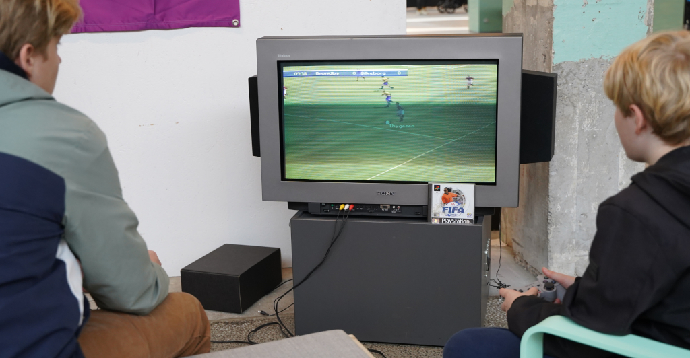

<!-- BEGIN ARISE ------------------------------
Title:: "Tilmelding"

Author:: "Retro Game Days"
Description:: "Tilmelding"
Language:: "da"
Thumbnail:: "figur-150x150.png"
Published Date:: "2025-06-17"
Modified Date:: "2025-06-17"

toc:: "false"
process_markdown:: "true"
content_header:: "false"
---- END ARISE \\ DO NOT MODIFY THIS LINE ---->

# Tilmelding
Torsdag og fredag er der gratis adgang for besøgende.

## Voksne & børn lørdag
Billet lørdag koster 40 kr. for voksne og 20 kr. for børn.

* Tilmeld dig her: [https://spinderihallerne.nemtilmeld.dk/1392/](https://spinderihallerne.nemtilmeld.dk/1392/)

## Butikker og salgsstande
Butik eller salgsstand med ting der knytter sig til retro spil og kultur koster 300kr. Det inkluderer tre borde på 160x70cm med duge. Esktra borde kan tilkøbes for 100kr per stk. Der er også mulighed for at vælge om man kommer alle dage eller kun lørdag.

* Tilmeld din butik/ salgsstand her: [https://spinderihallerne.nemtilmeld.dk/1394/](https://spinderihallerne.nemtilmeld.dk/1394/)

## Bliv en del af Retro Game Days
Har du en passion for gamle computere, spil eller noget tredje som vil passe ind i Retro Game Days kan du tilmelde dig ved at sende en mail til Jørgen på <jorti@vejlebib.dk>.

Du kan både have en stand hvor du viser din samling frem eller formidler din begejstring for dit yndlingsspil. Vores besøgende er begejstrede for at høre din historie og hvad du brænder for. Så hvis du gerne vil i kontakt med mennesker der deler din passion, så er Retro Game Days et godt sted.

Vi er også åbne for nye ideer og projekter, så skriv gerne en mail, hvis du har forslag.

